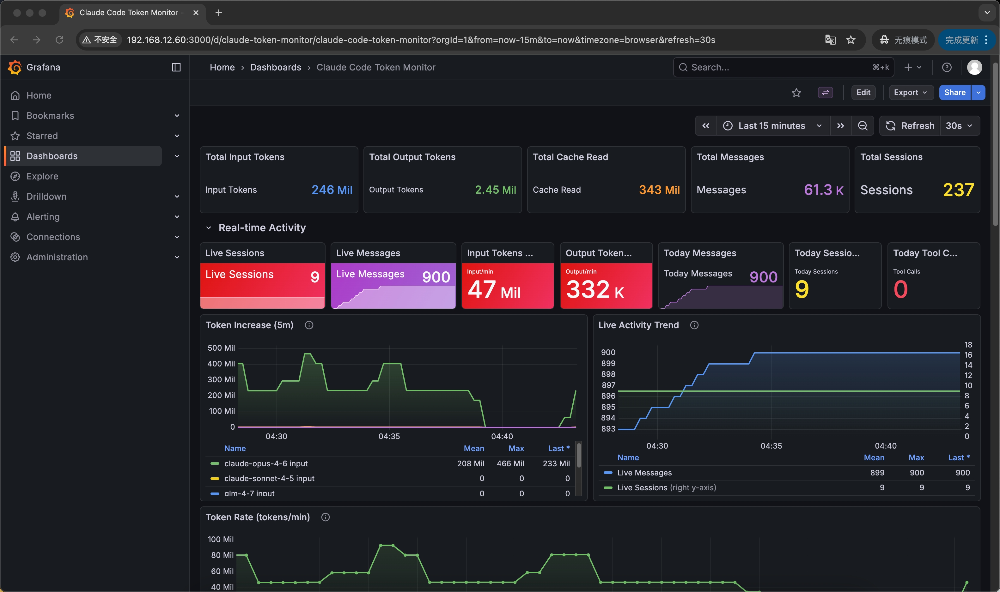
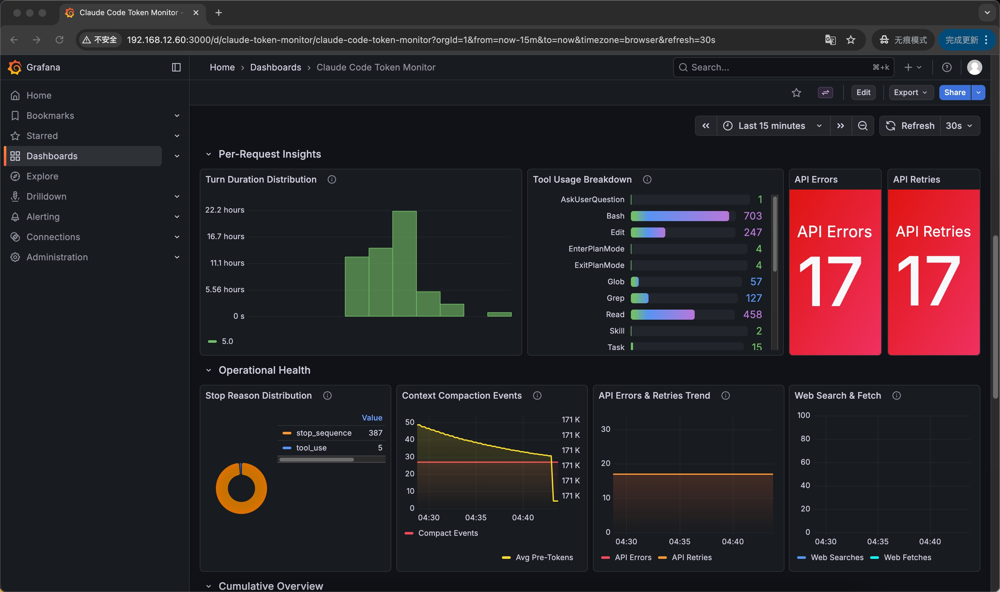
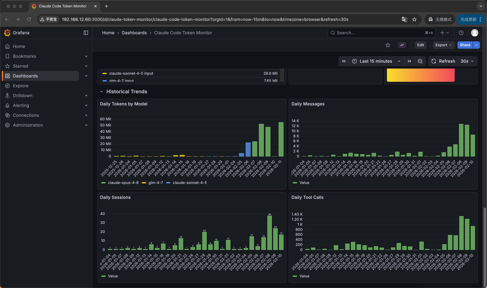

# CC Monitor

[](LICENSE)

[English](README.md)

开箱即用的 [Claude Code](https://docs.anthropic.com/en/docs/claude-code) 用量监控面板。

自动采集 Token 消耗、会话数、费用等数据，通过 Grafana 可视化展示。支持实时监控活跃会话。

## 截图





## 快速开始

确保已安装 [Docker](https://docs.docker.com/get-docker/)（含 Docker Compose），然后：

```bash
git clone https://github.com/aireet/cc-monitor.git
cd cc-monitor
./start.sh
```

打开浏览器访问 **http://localhost:3000/d/claude-token-monitor**，用户名密码均为 `admin`。

## 架构

```
~/.claude (只读)
    │
    ├── stats-cache.json ──► ┌──────────────┐     ┌────────────┐     ┌─────────┐
    └── projects/*/?.jsonl ─► │   Exporter   ├────►│ Prometheus ├────►│ Grafana │
                              │  (Go, :9101) │     │   (:9099)  │     │ (:3000) │
                              └──────────────┘     └────────────┘     └─────────┘
```

- **Exporter** — 读取 `stats-cache.json`（历史数据）+ 扫描活跃会话 JSONL 文件（实时数据），暴露 Prometheus 指标
- **Prometheus** — 每 30s 采集，数据保留 90 天
- **Grafana** — 预配置数据源和 Dashboard，开箱即用

## 监控指标

- Token 消耗总量（输入 / 输出 / 缓存读取 / 缓存创建），按模型分类
- 费用统计（USD），按模型分类
- 每日消息数、会话数、工具调用数趋势
- 每日各模型 Token 用量趋势
- 按小时分布的活跃度
- 实时活跃会话数和消息数

## 停止 / 重启

```bash
# 停止
docker compose down

# 重启
./start.sh
```

## 自定义

### Claude 数据路径

默认读取 `~/.claude`。如果路径不同：

```bash
export CLAUDE_HOME=/path/to/.claude
./start.sh
```

### 端口

修改 `docker-compose.yml` 中对应的端口映射即可：

| 默认端口 | 服务 |
|----------|------|
| 3000 | Grafana |
| 9099 | Prometheus |
| 9101 | Exporter |

## 数据安全

- 所有 Claude 数据以**只读**方式挂载
- 所有数据存储在本地，不会上传到任何外部服务

## License

MIT
